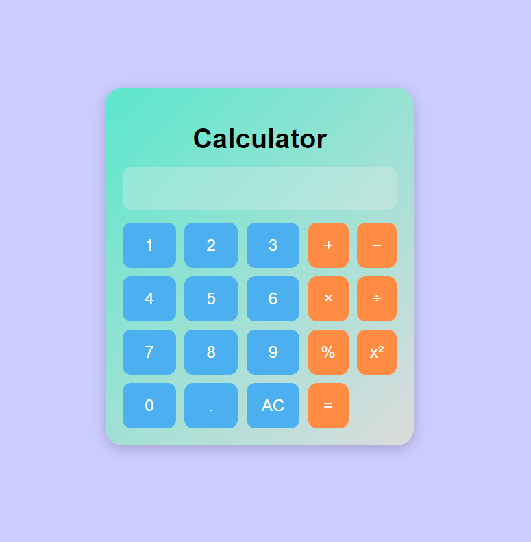

# 📱 Calculator – Web Application

## 📌 Project Overview  
A simple yet functional **Calculator Web Application** built using **HTML, CSS, and JavaScript**.  
The project demonstrates **basic web development skills** including layout design, styling, responsiveness, and JavaScript event handling.
---

## ✨ Features
- **Basic Arithmetic Operations** → Addition (+), Subtraction (−), Multiplication (×), Division (÷)  
- **Extra Functions** → Percentage (%), Square (x²)  
- **Clear Function** → AC button to reset input  
- **Decimal Support** → Perform operations with floating-point numbers  
- **Responsive Layout** → Works on both desktop and mobile devices  
- **User-Friendly Design** → Color-coded number & operation buttons for easy use  

---

## 🛠️ Technologies Used
- **HTML5** – Structure of the calculator  
- **CSS3** – Styling, layout, and responsiveness  
- **JavaScript (ES6)** – Functional logic and event handling  

---

## 📂 Project Structure
calculator-project/
├── index.html 
├── style.css 
├── script.js
└── README.md 

---

## ⚙️ How to Run the Project
1. **Download or Clone** the repository  
   ```bash
   git clone 

2. **Open the project folder**

3. **Double-click index.html to run it in your browser**

4. **Start calculating!** ✅

## 📸 Screenshot



🚀 Live Demo
You can view the live version of the project here:
https://calculator-shreyas.netlify.app

📜 License

This project is free to use for learning and educational purposes.
